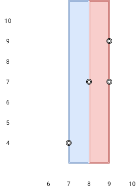

1637. Widest Vertical Area Between Two Points Containing No Points
      Easy
      Topics
      Companies
      Hint
      Given n points on a 2D plane where points[i] = [xi, yi], Return the widest vertical area between two points such that no points are inside the area.

A vertical area is an area of fixed-width extending infinitely along the y-axis (i.e., infinite height). The widest vertical area is the one with the maximum width.

Note that points on the edge of a vertical area are not considered included in the area.

Example 1:

​
Input: points = [[8,7],[9,9],[7,4],[9,7]]
Output: 1
Explanation: Both the red and the blue area are optimal.
Example 2:

Input: points = [[3,1],[9,0],[1,0],[1,4],[5,3],[8,8]]
Output: 3

Constraints:

n == points.length
2 <= n <= 105
points[i].length == 2
0 <= xi, yi <= 109

### The Reason why you can use sort() function to sort a Vec<Vec<i32>>
在 Rust 中，对 `Vec<Vec<i32>>` 这样的二维向量进行排序是因为 Rust 提供了针对 `Vec<T>` 类型的排序实现，其中 `T` 可以是任何实现了 `Ord` trait 的类型。在这种情况下，`Vec<i32>` 实现了 `Ord` trait，因为 `i32` 类型本身就是可以比较大小的。

当你调用 `sort` 方法时，Rust 编译器会根据 `Vec<i32>` 的 `Ord` trait 实现来进行排序。在这个特定的例子中，`Vec<i32>` 的排序是按照第一个元素的大小进行排序的。这是因为在 Rust 中，当对一个元组进行排序时，默认会按照元组中元素的顺序进行比较，而 `Vec<i32>` 实际上可以看作是一个元组，因此会按照第一个元素的大小来进行排序。

底层原理涉及到 Rust 的标准库实现和泛型特化。Rust 的标准库中的 `sort` 方法是一个泛型方法，它接受一个实现了 `Ord` trait 的迭代器，并对其进行排序。对于 `Vec<T>` 类型，如果 `T` 实现了 `Ord` trait，那么 `Vec<T>` 也就可以使用 `sort` 方法进行排序。

在这种情况下，`Vec<i32>` 实现了 `Ord` trait，因此 `Vec<Vec<i32>>` 类型也可以使用 `sort` 方法进行排序。在底层，Rust 编译器会根据 `Ord` trait 的实现对元素进行比较，从而实现排序功能。

因此，对 `Vec<Vec<i32>>` 使用 `sort` 方法并按照 `Vec<i32>` 的第一个元素排序并不是特化，而是利用了 Rust 强大的泛型特性和 trait 约束来实现的。
