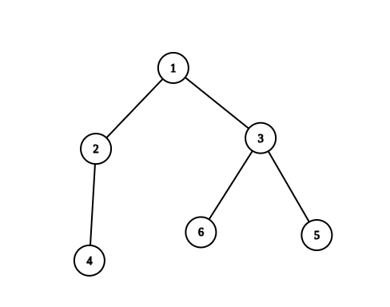

2867. Count Valid Paths in a Tree
Hard
Topics
Companies
Hint
There is an undirected tree with n nodes labeled from 1 to n. You are given the integer n and a 2D integer array edges of length n - 1, where edges[i] = [ui, vi] indicates that there is an edge between nodes ui and vi in the tree.

Return the number of valid paths in the tree.

A path (a, b) is valid if there exists exactly one prime number among the node labels in the path from a to b.

Note that:

The path (a, b) is a sequence of distinct nodes starting with node a and ending with node b such that every two adjacent nodes in the sequence share an edge in the tree.
Path (a, b) and path (b, a) are considered the same and counted only once.
 

Example 1:

Input: n = 5, edges = [[1,2],[1,3],[2,4],[2,5]]
Output: 4
Explanation: The pairs with exactly one prime number on the path between them are: 
- (1, 2) since the path from 1 to 2 contains prime number 2. 
- (1, 3) since the path from 1 to 3 contains prime number 3.
- (1, 4) since the path from 1 to 4 contains prime number 2.
- (2, 4) since the path from 2 to 4 contains prime number 2.
It can be shown that there are only 4 valid paths.
Example 2:

Input: n = 6, edges = [[1,2],[1,3],[2,4],[3,5],[3,6]]
Output: 6
Explanation: The pairs with exactly one prime number on the path between them are: 
- (1, 2) since the path from 1 to 2 contains prime number 2.
- (1, 3) since the path from 1 to 3 contains prime number 3.
- (1, 4) since the path from 1 to 4 contains prime number 2.
- (1, 6) since the path from 1 to 6 contains prime number 3.
- (2, 4) since the path from 2 to 4 contains prime number 2.
- (3, 6) since the path from 3 to 6 contains prime number 3.
It can be shown that there are only 6 valid paths.
 

Constraints:

1 <= n <= 105
edges.length == n - 1
edges[i].length == 2
1 <= ui, vi <= n
The input is generated such that edges represent a valid tree.