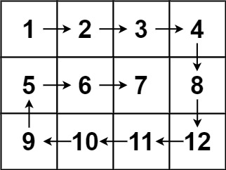

[54. Spiral Matrix](https://leetcode.com/problems/spiral-matrix/)

Medium

Topics

Companies

Hint

Given an `m x n` `matrix`, return *all elements of the* `matrix`  *in spiral order* .

**Example 1:**

<pre><strong>Input:</strong> matrix = [[1,2,3],[4,5,6],[7,8,9]]
<strong>Output:</strong> [1,2,3,6,9,8,7,4,5]
</pre>

**Example 2:**

<pre><strong>Input:</strong> matrix = [[1,2,3,4],[5,6,7,8],[9,10,11,12]]
<strong>Output:</strong> [1,2,3,4,8,12,11,10,9,5,6,7]
</pre>

**Constraints:**

* `m == matrix.length`
* `n == matrix[i].length`
* `1 <= m, n <= 10`
* `-100 <= matrix[i][j] <= 100`
