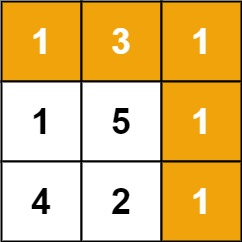

[64. Minimum Path Sum](https://leetcode.com/problems/minimum-path-sum/)

Medium

Topics

Companies

Given a `m x n` `grid` filled with non-negative numbers, find a path from top left to bottom right, which minimizes the sum of all numbers along its path.

**Note:** You can only move either down or right at any point in time.

**Example 1:**

<pre><strong>Input:</strong> grid = [[1,3,1],[1,5,1],[4,2,1]]
<strong>Output:</strong> 7
<strong>Explanation:</strong> Because the path 1 → 3 → 1 → 1 → 1 minimizes the sum.
</pre>

**Example 2:**

<pre><strong>Input:</strong> grid = [[1,2,3],[4,5,6]]
<strong>Output:</strong> 12
</pre>

**Constraints:**

* `m == grid.length`
* `n == grid[i].length`
* `1 <= m, n <= 200`
* `0 <= grid[i][j] <= 200`
