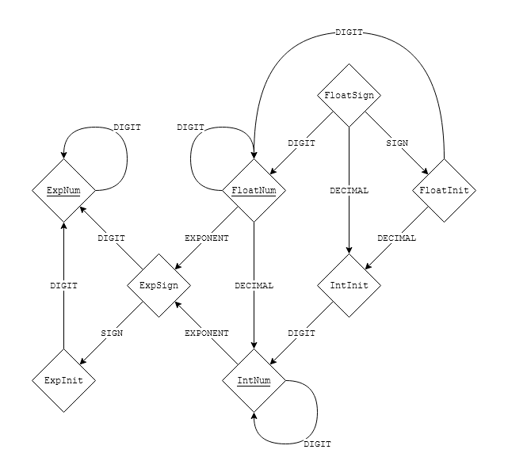

65. Valid Number
    Hard
    Topics
    Companies
    Given a string s, return whether s is a valid number.

For example, all the following are valid numbers: "2", "0089", "-0.1", "+3.14", "4.", "-.9", "2e10", "-90E3", "3e+7", "+6e-1", "53.5e93", "-123.456e789", while the following are not valid numbers: "abc", "1a", "1e", "e3", "99e2.5", "--6", "-+3", "95a54e53".

Formally, a valid number is defined using one of the following definitions:

An integer number followed by an optional exponent.
A decimal number followed by an optional exponent.
An integer number is defined with an optional sign '-' or '+' followed by digits.

A decimal number is defined with an optional sign '-' or '+' followed by one of the following definitions:

Digits followed by a dot '.'.
Digits followed by a dot '.' followed by digits.
A dot '.' followed by digits.
An exponent is defined with an exponent notation 'e' or 'E' followed by an integer number.

The digits are defined as one or more digits.

State Machine(My Solution)

State Machine(Solution)

Example 1:

Input: s = "0"

Output: true

Example 2:

Input: s = "e"

Output: false

Example 3:

Input: s = "."

Output: false

Constraints:

1 <= s.length <= 20
s consists of only English letters (both uppercase and lowercase), digits (0-9), plus '+', minus '-', or dot '.'